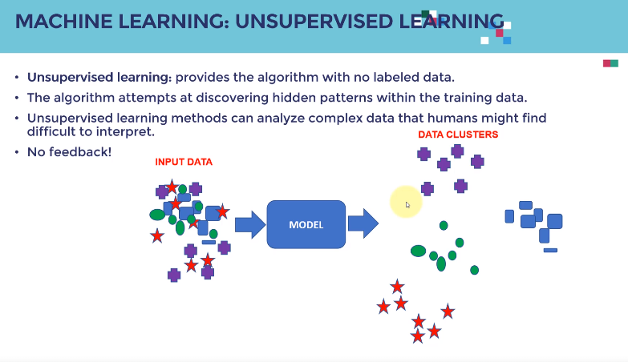

Tip: AWS 프리 계정 및 t2 중간 비용 유지

## 머신러닝의 기본

- 데이터 + 모델(회귀/분류) + Compute(CPU/GPU)
    - 세이지 메이커를 통해 위 작업 모두 수행 가능

- 인공지능
    - 컴퓨터가 의사 결정을 내릴 수 있는 시스템 
- 머신러닝
    - 경험을 바탕으로 주어진 작업을 개선할 수 있는 시스템
    - 여기서 핵심 단어는 경험
    - 머신 러닝은 하나로 분류된다.

- 딥러닝
    - 비즈니스, 의료 서비스, 수많은 산업에 적용
    - 이미지와 같이 대용량 데이터가 사용되는 곳에 심층 인공 신경망을 기반으로 하는 머신러닝 분야
    - 여러 사례 연구를 통해 딥러닝 모델 구축 및 배포 방법
    - 딥러닝은 뇌의 구조에서 영감을 받은 정보 처리 시스템 다양한 가중치, 뉴런 존재

- 차이점 
    - 기능을 자동으로 추출하는 능력 (딥러닝)
    - 머신러닝을 통해 개와 고양이 이미지를 분류하려면, 각 모양의 특징을 수동으로 추출하고 분류를 진행해야 함
    - 딥러닝을 활용하면 이를 자동으로 할 수 있음(특징 추출 등 자동으로)

## 머신러닝

### 1)  지도학습(Supervised Learning)
- 라벨이 있는 입출력 데이터를 통한 훈련 알고리즘

### 2) 비지도학습(Unsupervised Learning)
- 라벨이 없는 데이터를 통한 훈련 알고리즘
- 알고리즘에게 숨겨진 패턴을 스스로 학습하도록 요청

### 3) 강화학습
- 특정 방향으로 가는 경우 보상, 아니면 패널티를 주는 방식으로 알고리즘을 설계 후 반복적으로 시도하여 누적된 보상이 극대화되는 방향으로 학습하는 방법

## 지도 학습

- 레이블 된 값이 있는 입력과 출력 데이터를 이용해서 알고리즘을 훈련하기 위한 방법

- 성능은 모델이 예측한 결과와 실제 결과를 비교해서 평가됨 

## 비지도 학습
- 인간이 해석하기 어려울 수 있는 복잡한 데이터를 분석할 수 있음
- 비지도 학습이 갖고 있는 문제 중 하나는 피드백이 없는 점

## 강화 학습
- 인간의 경험과 같은 학습
- 행동에 따라 패널티를 받거나 보상을 받음 이를 통해 학습하고 다음 의사를 결정 

 - 마치 아이의 학습 과정과 같다.

 ---
 ---
 ## 데이터

 - 데이터는 라벨의 유무에 따라 구분 가능

 - 데이터는 어디서나 얻을 수 있다. 

 #### 1) 좋은 데이터란
 - 많은 양과 많은 데이터 포인트를 갖고 있다.
- 관련성이 많은 좋은 특징을 갖고 있음
- 중복 데이터가 없음 

 #### 2) 나쁜 데이터란
 - 적은 샘플 수와 적은 양의 데이터 포인트를 갖고 있음
- 누락된 데이터 포인터를 갖고 있음
- 누락된 정보를 채우는 작업이 필요함.
- 중복 데이터가 있어 제거 작업이 필요함
--- 
## 조건 
 - 머신러닝을 구현하기 위해 많은 데이터 샘플이 필요하다.
- 데이터는 kaggle, UCI, AWS데이터 세트, ImageNet 등에서 얻을 수 있음

---
## 데이터를 찾는 방법
- kaggle은 다양한 데이터 세트를 제공하고 대회들도 운영
- UCI는 분류, 회귀, 클러스터 문제와 같은 다양한 문제들과 정보, 물리, 생명 비즈니스, 게임 기타 등등 다양한 정보 확인 가능

- AWS는 가공 가능한 다양한 데이터 세트를 제공
- ImageNet은 레이블된 수 백만개의 이미지들의 저장소
---

