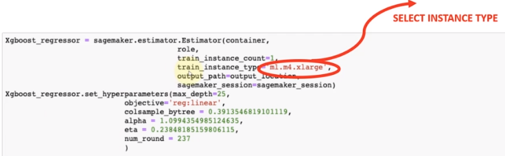

# AWS_Sagemaker
AWS를 공부합니다. 

## 다루게 될 내용
1. AWS 기초
2. 클라우딩 컴퓨팅의 이점

---

## AWS란 
- 세계적인 클라우드 컴퓨팅 플랫폼
- 모두 완전한 기능을 갖춘 서비스
- 165개 넘는 서비스 제공
- GPU 및 기타 하드웨어 구매 없이 ML 이용 가능 및 사용량에 따른 비용 지불
- 저장공간에서 AWS 사용(S3 사용)

- 데이터베이스, 네트워킹, 분석, 인공지능 서비스 제공 
- IoT도 사용 가능
- 다양한 기업에서 활용 가능
- 모든 것을 구축할 수 있는 유연하고 안전한 시스템

---
## 클라우드 컴퓨팅
- 온디맨드 시스템
- 원하는 다양한 구성
- 컴퓨팅, 스토리지 
- 학습된 머신러닝 모델 구축 가능
- 물리적 서버나 하드웨어 컴퓨터 구입 필요 없이 온디맨드 방식으로 모든 것을 활용 가능

- 빅데이터, 재해복구, 이메일 전송 뿐만 아니라 은행 업무에서 부정 거래 실시간 방지 가능
- SageMaker에서 사기 방지를 위한 AI 모델 생성 구축 가능

---
## 클라우드 컴퓨팅 이점
#### 1) 민첩성
- 비싼 물리 하드웨어를 구입하는 대신 아마존에서 준비한 시스템을 활용 가능
- 새로운 아이디어를 빠르게 적용하고 실습할 수 있다.
#### 2) 탄력성
- 수요에 따라 리소스 확장, 축소 가능
- 서비스에 따라 예상되는 수요가 모를경우가 많은데 사용량에 따라 비용을 지불함으로 탄력적인 대응 가능
#### 3) 비용 절감
- 대규모 서버를 구입하는 것과 같은데 절감된 비용으로 활용 가능
- 규모 경제의 힘
#### 4) 속도
- AWS 인프라는 전 세계에서 이용 가능
- 사용 가능한 다양한 지역에 배포 가능
- 완벽한 성능과 최소의 대기 시간으로 적용 가능

--- 
---

## AWS의 Availability zone (가용성 영역, Region)
- 특정 지역에 위치한 데이터 센터
- 가용성을 보장하고 동시에 두 영역이 중단될 가능성을 줄이기 위해 AWS는 각 영역에 여분의 분리된 영역 및 네트워킹을 제공
- AWS는 서비스를 높은 내구성과 가용성으로 시장에 출시

- 서비스를 활성화할 지역을 선택할 수 있고, 이에 따라 비용이 달라질 수 있음

## AWS의 S3

- 기업과 개인이 데이터를 간단하게 저장하고 보호할 수 있는 서비스
- 물리적인 서버나 저장 매체를 구입할 필요 없다.
- S3과 세이지 메이커를 사용하여 ML 구현 가능
    - SageMaker는 데이터를 S3에 업로드 하도록 요구
    - 모델이 학습된 후 모델 아티팩트도 S3에 업로드 한다.
    - 이것이 S3를 사용하는 이유!
- 확장성, 가용성, 보안, 내구성, 높은 성능이 특징
- 기업은 데이터를 정리하고 세밀하게 접근성을 설정 가능

---
- S3는 고객이 버킷 혹은 디렉터리라고 하는 곳에 데이터를 저장하고 구성할 수 있도록 만들어져있다.
- 버킷은 S3에 저장된 객체를 담는 컨테이너이고, 모든 객체는 버킷에 담긴다.
- 각각의 버킷은 고유 이름을 갖는다.
    - 다른 사람이 공유하는 이름의 버킷을 가질 수 없다.

- 버킷에 무한대의 데이터를 저장할 수 있다.
- 버킷 내 각 객체는 5TB의 데이터 용량으로 제한됨.(사실 상 무제한)

---
### S3 Storage Service
#### 1) Standard
- 일반적인 용도와 데이터에 자주 접근하는 경우
#### 2) Intelligence Tiering
- 자주 바뀌는 데이터 패턴의 경우
#### 3) Standard IA & One Zone IA
- 단순히 오랜 기간 보관하지만 데이터에 엑세스하는 빈도가 낮은 경우

#### 4) Glacier and Deep Archive
- 장기적인 데이터를 보관하는 경우(의료 정보 등)
- 엑세스 X

---
### 위와 같이 S3는 수명 주기 정책을 이용하고, Storage Tier를 변경할 수 있다. 
---
---
## AMS Elastic Compute Cloud (EC2)란!

- EC2는 클라우드에서 크기를 조정할 수 있는(elastic) 컴퓨팅 용량을 제공
- 클라우드에서 서버를 빌려쓴다는 의미
- AI/ML EC2를 활용하여 GPU, CPU 서비스를 대여

- 쉬운 방식으로 용량을 확보, 구성, 확장 가능
- 22개 지역 69개 가용성 지역

## EC2 인스턴스 타입
#### 1) Standard
- ml.t2.medium: 일반적인 성능
- 페이지에서 성능 확인 가능

#### 2) Memory Optimized
- r
#### 3) Compute Optimized
- c
#### 4) Accelerated Computing
- g: GPU를 위함
- 대규모 작업(네트워크 등)에 사용
---

- Deep Learning 사용 시 높은 성능 필요
- AI 모델 사용 시 위와 같은 인스턴스 유형을 지정해야 함

## Elastic Inference
- SageMaker에서는 엔드포인트 위에 가속기를 설치할 수 있는 옵션을 제공하고, 전용 GPU를 사용하는 것보다 적은 비용으로 가속기의 속도를 활용할 수 있다.
- EI를 활용해 속도를 높히고 지연 시간을 줄여 딥러닝 모델에 대한 실시간 영향을 얻을 수 있다.
- 전용 GPU 인스턴스를 엔드포인트에 활용하거나 사용하는 것 대신 간단히 CPU 인스턴스를 사용하고 가속기를 연결할 수 있다.

## EC2 Instance Pricing - 인스턴스의 가격을 결정하는 요소
#### 1) On-demand
- 수요에 따른 비용 지불

#### 2) Spot instance
- On demand에 비해 낮은 가격
- 일반적인 수요가 없는 경우에 사용
- SageMaker에서 spot instance = true를 불러와 활성화할 수 있다. 
#### 3) Reserved Instances

- 용량 예약을 제공(1~3년)
- 이에 따라 할인을 받을 수 있다.
#### 4) Dedicated Hosts
- 기업 전용 호스트
- 자사의 라이센스를 사용하는 탄력성을 제공

---
## IAM and Access management service
- IAM은 사용자가 안전하게 AWS 서비스에 엑세스하고 관리할 수 있도록 한다. 
- AWS 사용자 및 그룹을 만들고 EC2와 같은 특정 서비스에 대한 엑세스를 제공하거나 거부할 수 있다.

- AL/ML 모델을 세이지 메이커에서 학습시킬 때 누가 노트북 인스턴스에 엑세스할 수 있는지, 누가 S3 버킷 등에 엑세스할 수 있는지 등의 엑세스 권한을 지정해야 한다.

- AWS 루트 계정은 이메일 주소화 암호를 사용하여 생성한 계정이며 루트 계정은 완전한 관리 엑세스 권한을 가지고, 이 계정에 엑세스할 수 있는 모든 사용자가 기본적으로 모든 작업을 수행할 수 있다.

- 루트 계정만의 사용은 보안 측면에서 위험성이 있으므로 IAM 역할 또는 계정 접근 관리 역할을 생성한 다음, 루트 사용자의 자격을 설정할 것을 권장한다. 
- 실제로 세이지 메이커의 코드에서 IAM의 역할을 어떻게 지정할 것인지 설정한다.

- 일부 관리 작업에 대해서만 루트 사용자 자격 증명이 필요, 다중 요소 인증을 이용한 추가적인 보안 계층을 가지고 있어야 한다.
