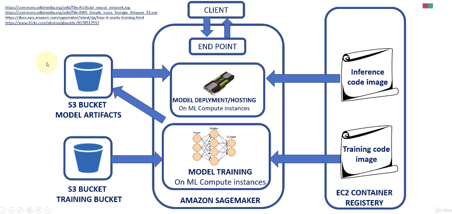

## 머신 러닝의 일반적인 흐름

1. 데이터 준비
- 일반적으로 데이터는 구조적이지 않음
- 이미지 수집 및 정확하게 레이블화(구조화) 해야함

2. 머신 러닝 모델 선택
- 지도/비지도 및 알고리즘 등
- 주성분 분석/단순 선형 학습 등

3. Training 환경 구축 및 학습
- CPU/GPU 설정
- 하이퍼 파라미터 조정
- 과적합 방지를 위한 학습률 조정 등
- 이후 학습 실행을 관리해야 한다.
- 다양한 실험을 통해 모델을 수정하고 개선하고 검증해야 한다.

4. 배포 및 관리

- 위 과정을 통해 만든 엔드포인트를 전 세계 누구나 호출할 수 있도록 배포하고 관리해야 한다.
- 해당 모델이 고객에게 적합하고 정확한가 검증해야 한다. (확장을 위해)

- 데이터 사이언티스트와 머신러닝 실무자는 이 엔드포인트를 계속 추적하고 확장해야 한다.

#### 세이지 메이커는 위 모든 과정을 진행할 수 있다.

### AWS SageMaker flow

1. 이미지를 갖고 있고 이 이미지에 라벨을 추가하고 싶다면, Ground Truth를 활용하여 라벨링 작업 가능
2. Mechanical Turk를 통해 레이블러들이 작업 가능
3. 손쉽게 이용 가능한 노트 생성 가능
4. 규모에 관계 없이 모델 생성 및 하이퍼 파라미터 조정 가능
5. 모델이 훈련 완료되면, 추론을 할 엔드포인트 생성, 호출 가능
6. 엔트포인트 기반 예측 가능
7. 손쉽게 이용 가능한 모델 구매 가능

## SageMaker Studio
- 단 한번에 머신 러닝 작업 흐름 속에서 하고 싶은 모든 것을 제공해주는 통합 개발 환경(IDE)
    - 모델 생성, 훈련, 조정, 배포, 관리 모두 가능
    - 라벨링은 불가능(Ground Truth에서 해야함)
- 모델 생성부터 배포까지 상세 내용은 실습을 통해!

## SageMaker 모델 개발, 배포 개요

- 모델 학습 시 모든 학습 데이터는 S3버킷 속에 있어야 한다. (검증용 데이터 포함)

- SageMaker에서 주성분 분석, XGBoost와 같은 알고리즘 사용 가능. (EC2 컨테이너 레버리지 안에 저장되어 있음)

