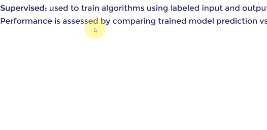

- t2 중간 비용 유지

## 머신러닝의 기본

- 데이터 + 모델(회귀/분류) + Compute(CPU/GPU)
    - 세이지 메이커를 통해 위 작업 모두 수행 가능

- 인공지능
    - 컴퓨터가 의사 결정을 내릴 수 있는 시스템 
- 머신러닝
    - 경험을 바탕으로 주어진 작업을 개선할 수 있는 시스템
    - 여기서 핵심 단어는 경험
    - 머신 러닝은 하나로 분류된다.

- 딥러닝
    - 비즈니스, 의료 서비스, 수많은 산업에 적용
    - 이미지와 같이 대용량 데이터가 사용되는 곳에 심층 인공 신경망을 기반으로 하는 머신러닝 분야
    - 여러 사례 연구를 통해 딥러닝 모델 구축 및 배포 방법
    - 딥러닝은 뇌의 구조에서 영감을 받은 정보 처리 시스템 다양한 가중치, 뉴런 존재

- 차이점 
    - 기능을 자동으로 추출하는 능력 (딥러닝)
    - 머신러닝을 통해 개와 고양이 이미지를 분류하려면, 각 모양의 특징을 수동으로 추출하고 분류를 진행해야 함
    - 딥러닝을 활용하면 이를 자동으로 할 수 있음(특징 추출 등 자동으로)

## 머신러닝

### 1)  지도학습(Supervised Learning)
- 라벨이 있는 입출력 데이터를 통한 훈련 알고리즘

### 2) 비지도학습(Unsupervised Learning)
- 라벨이 없는 데이터를 통한 훈련 알고리즘
- 알고리즘에게 숨겨진 패턴을 스스로 학습하도록 요청

### 3) 강화학습
- 누적된 보상을 극대화하는 방식으로 조치를 취하는 알고리즘

## 지도학습

- 